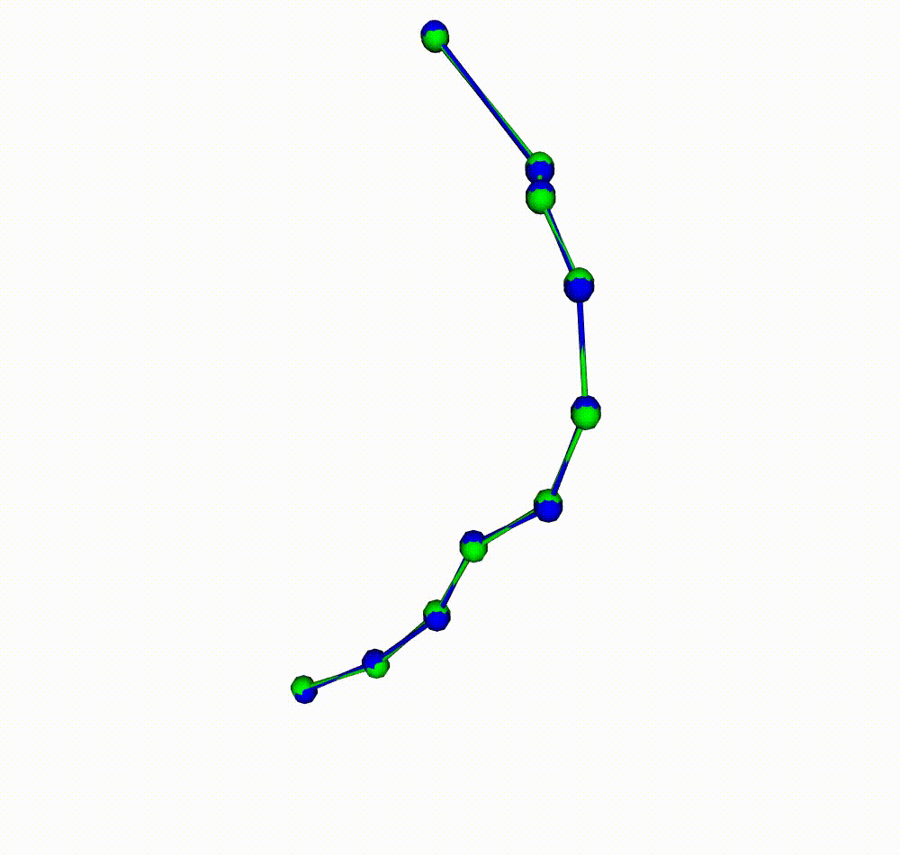
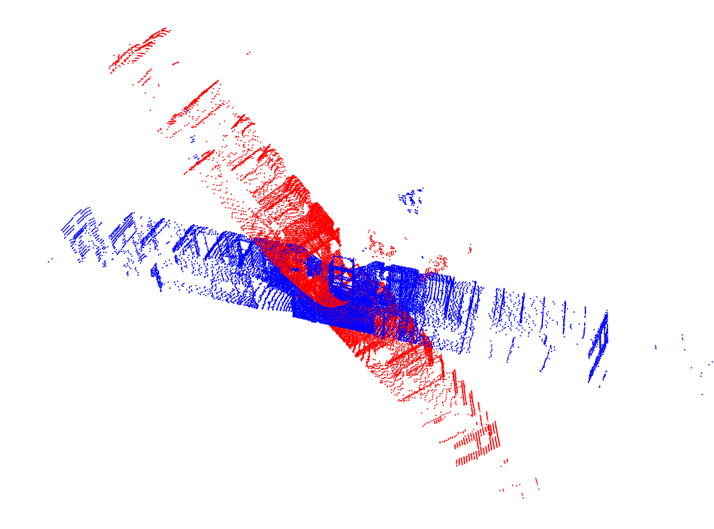
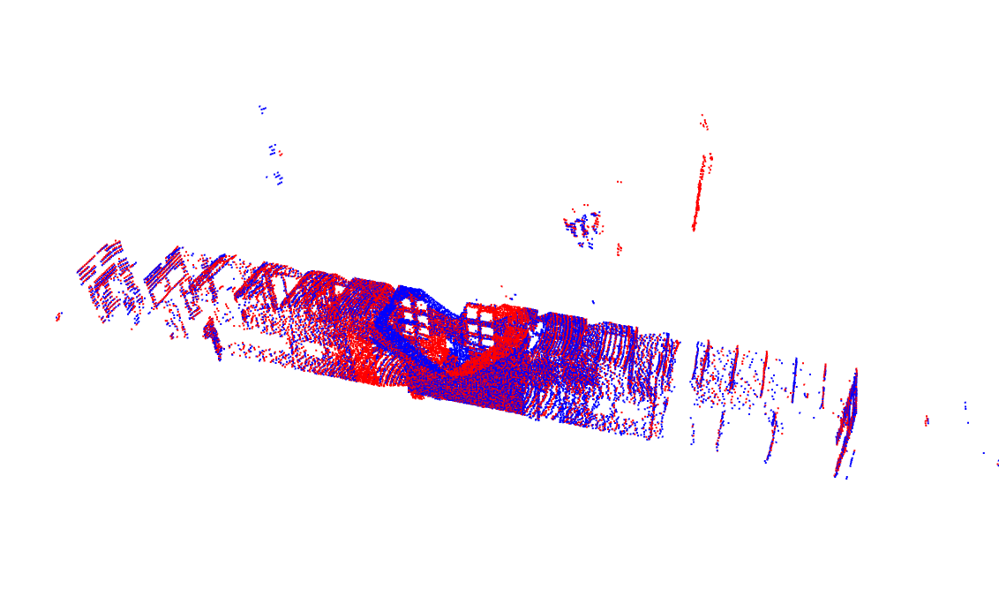
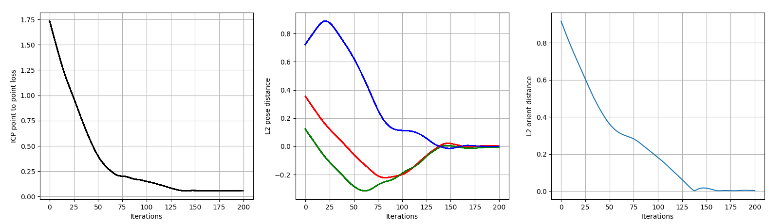
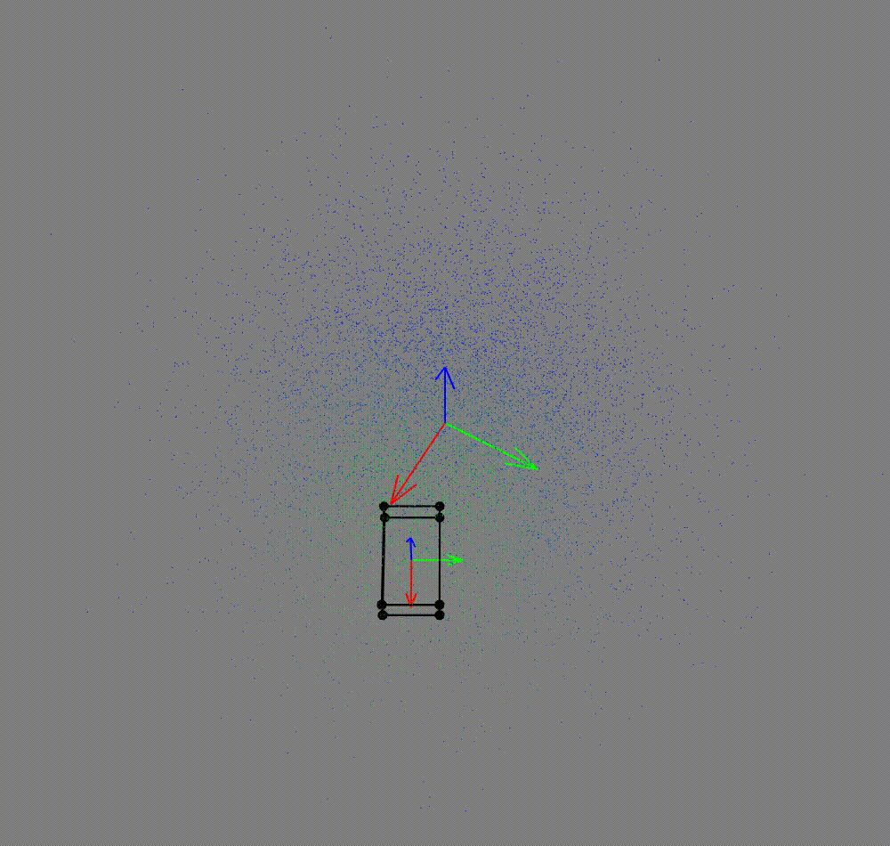

# Differentiable Robotics

Collection of differentiable methods for robotics applications implemented with
[Pytorch](https://pytorch.org/).

Please, run the examples from the `src` directory of the repository.

## Path Smoothing



```commandline
python -m trajopt.smooth_path
```

## ICP point cloud alignment

 



```commandline
python -m icp.align_clouds
```

## Bounding box Pose Optimization

The optimization is based on a point cloud coverage function by the bounding box.


