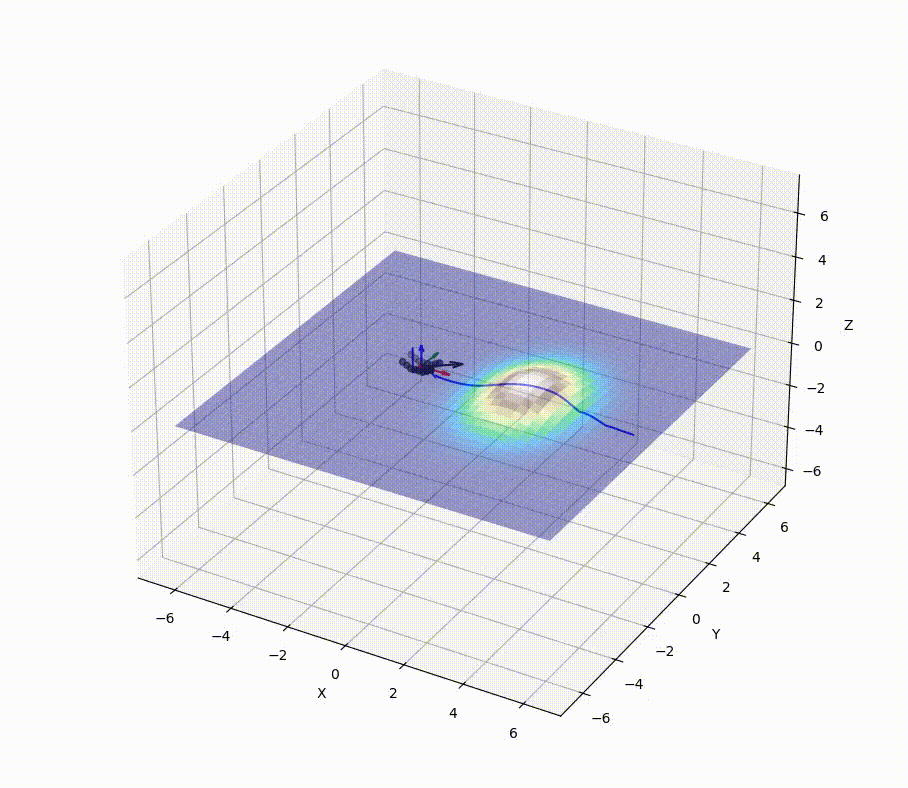
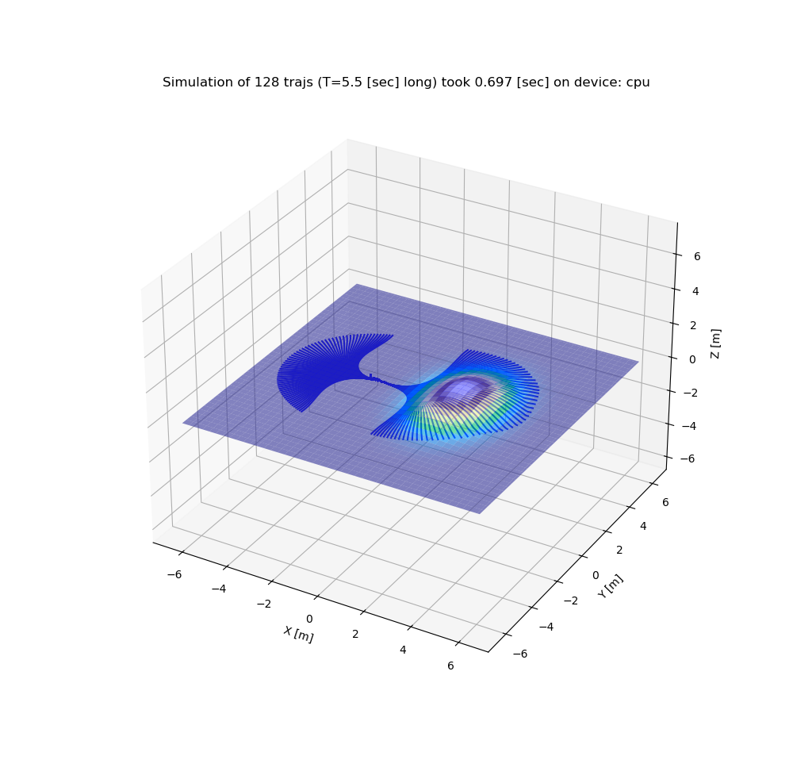

# Differentiable Robotics

Collection of differentiable methods for robotics applications implemented with
[Pytorch](https://pytorch.org/).

## Robot-terrain interaction

 
    
```commandline
cd scripts/
python robot_terrain_interaction.py
```

Reference: [MonoForce: Self-supervised Learning of Physics-informed Model for Predicting Robot-terrain Interaction
](https://arxiv.org/abs/2309.09007)


## ICP point cloud alignment

 


```commandline
cd src/
python -m icp.align_clouds
```

Reference: [Self-Supervised Depth Correction of Lidar Measurements From Map Consistency Loss
](https://ieeexplore.ieee.org/document/10158328)


## Fit a bounding box to a point cloud

The optimization is based on a point cloud coverage function by the bounding box.


## Path smoothing


```commandline
cd src/
python -m trajopt.smooth_path
```